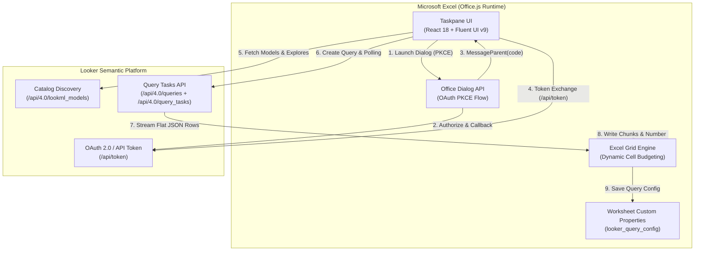

# Looker Microsoft Excel Add-in

Enterprise Microsoft Excel Taskpane Add-in (Office.js) connecting Excel workbooks directly to Looker's semantic modeling layer. It enables business users, financial analysts, and data teams to authenticate via Looker OAuth 2.0 PKCE, explore models and views, select dimensions and measures, configure pivots and sort orders, apply typed filters, and stream high-volume datasets into Excel worksheets with one-click refresh and formatting preservation.

---

## Walkthrough & Demo


---

## Architecture Overview



---

## Key Capabilities

### Looker CORS OAuth 2.0 with PKCE & Silent Refresh

- Native browser-based OAuth 2.0 authentication utilizing Proof Key for Code Exchange (PKCE, RFC 7636).
- Adheres to Looker's CORS API specification (`scope=cors_api`, 32-byte cryptographic state verification, direct token exchange at `POST /api/token`).
- Operates securely across macOS WebKit, Windows WebView2, and Excel on the Web using the Office Dialog API to avoid third-party cookie restrictions and iframe blocking.
- Implements proactive and silent token validation (`ensureValidToken`) to refresh expired sessions automatically on Excel relaunch and taskpane initialization.

### Field Discovery & Search

- Search dimensions and measures across names, labels, short labels, view labels, field groups, and LookML metadata.
- Provides field inspection popovers displaying descriptions, technical field identifiers, and data types.
- Supports visual drag-and-drop reordering on selected field chips to customize column sequences.

### Pivots & Crosstab Grid Expansion

- One-click pivot toggle on selected dimension chips.
- Converts Looker nested crosstab responses into flattened Excel column matrices with hierarchical headers.
- Preserves measure-specific formatting masks (currency, percentages, timestamps) across dynamically generated pivot columns.

### Multi-Field Sorting

- Independent ASC and DESC sort toggling across selected dimension and measure chips.
- Visual sort indicators with automatic multi-field precedence tracking.

### Required Prompts & Typed Filters

- Detects required LookML parameters and `always_filter` declarations, displaying an interactive prompt dialog prior to query execution.
- Specialized filter operators tailored to data types:
  - String filters: Live suggestion autocompletion via Looker's suggestions API.
  - Date filters: Relative timeframes (`is_in_the_last`, `is_this`, `is_previous`), date ranges (`is_in_range`), exact day matching, and before/after boundaries.
  - Numeric filters: Comparison operators (`=`, `!=`, `>`, `>=`, `<`, `<=`, `between`, `is_null`, `is_not_null`).

### High-Volume Asynchronous Streaming

- Multi-step Looker query execution using `POST /api/4.0/queries` followed by `POST /api/4.0/query_tasks` with `result_format: "json"`.
- Asynchronous polling with live elapsed time, row count counters, and query cancellation via `DELETE /api/4.0/running_queries/{id}`.
- Flat key-value format keeps client memory consumption under 45 MB even on high-row queries (100,000+ rows).

### Adaptive Batch Cell Budgeting & Calculation Suspension

- Dynamically calculates row chunk sizes based on column count (`batchSize = max(500, floor(35,000 / colCount))`) to guarantee write payloads remain well below the 4 MB Office.js transaction limit.
- Suspends Excel screen updating and calculation engines during batch writes to eliminate UI stutter and freezing.

### Formula Auto-Expansion & Formatting Preservation

- Detects custom Excel formulas placed in adjacent columns and automatically fills them down as data expands during refresh.
- Preserves user custom formatting (fills, borders, font styles) on refreshed ranges.

### Workbook Persistence & Multi-Sheet Catalog

- Query configurations (model, explore, fields, filters, sorts, column formats) are stored directly inside worksheet custom properties (`sheet.customProperties`) under the key `looker_query_config`.
- Moving or emailing the `.xlsx` workbook preserves query configurations without writing any access tokens or secrets to the file.
- Switching worksheet tabs automatically synchronizes the taskpane view. The header supports refreshing all connected Looker sheets in the workbook in a single sequence.

---

## Technical Stack

- Framework: React 18, TypeScript, Fluent UI v9 (`@fluentui/react-components`, `@fluentui/react-icons`)
- Host Platform: Office JavaScript API (`Office.js`), Excel JavaScript Requirement Set 1.14+
- Build & Bundler: Webpack 5, `html-webpack-plugin`, `copy-webpack-plugin`, `ts-loader`
- Development Tooling: `office-addin-dev-certs`, `webpack-dev-server`
- API Target: Looker API 4.0

---

## Prerequisites

1. Node.js: Version 18 or higher with npm.
2. Microsoft Excel:
   - Microsoft 365 on Windows (Microsoft Edge WebView2)
   - Microsoft 365 / Office 2021 on macOS (v16.60+)
   - Excel on the Web (Office Online)
3. Looker Instance: Version 23.0 or higher with network access from your browser and an OAuth Client Application registered.
4. Looker User Permissions & Licensing:
   - End users must be assigned a Looker role containing **`access_data`** and **`explore`** permissions on the target LookML models (Standard User or Developer license tier).
   - The `explore` permission is required by Looker API 4.0 (`/api/4.0/lookml_models` and `/api/4.0/lookml_models/{model}/explores/{explore}`) to discover LookML models and Explore schemas.

---

## Looker Configuration

To allow the Excel add-in to communicate with Looker, register an OAuth Client Application in Looker.

### Register OAuth Client Application

An admin can register the OAuth client via the Looker API or Looker Admin Console:

```bash
curl -X POST "https://<your-instance>.cloud.looker.com/api/4.0/oauth_client_apps" \
  -H "Authorization: token <ADMIN_ACCESS_TOKEN>" \
  -H "Content-Type: application/json" \
  -d '{
    "client_guid": "looker-excel",
    "redirect_uri": "https://localhost:3000/dialog-callback.html",
    "display_name": "Looker Microsoft Excel Add-in",
    "description": "Taskpane integration for Microsoft Excel",
    "enabled": true
  }'
```

For production deployments, set `redirect_uri` to your hosted domain (e.g. `https://<your-production-domain>/dialog-callback.html`).

### CORS Domain Allowlist

Ensure your add-in origin (`https://localhost:3000` for development or your production hosting domain) is added to the domain allowlist in Looker:

1. In Looker, navigate to Admin > Platform > API.
2. In Embedded Domain Allowlist or CORS Allowlist, add your hosting origin.

---

## Installation & Setup

### 1. Clone & Install Dependencies

```bash
git clone https://github.com/<your-org>/looker-on-excel.git
cd looker-on-excel
npm install
```

### 2. Generate Development SSL Certificates

Office add-ins require HTTPS. Generate local certificates trusted by your operating system:

```bash
npx office-addin-dev-certs install
```

### 3. Start Development Server

```bash
npm start
```

The dev server starts on `https://localhost:3000`. You can verify by opening `https://localhost:3000/taskpane.html` in your browser.

---

## Sideloading the Add-in in Excel

### macOS Desktop

1. Verify or create the WEF sideloading folder:
   ```bash
   mkdir -p ~/Library/Containers/com.microsoft.Excel/Data/Documents/wef
   ```
2. Copy the manifest file into the directory:
   ```bash
   cp manifest.xml ~/Library/Containers/com.microsoft.Excel/Data/Documents/wef/
   ```
3. Restart Microsoft Excel.
4. On the Home or Insert ribbon, select the Looker icon, or navigate to Insert > My Add-ins to open the taskpane.

### Windows Desktop

1. Share a folder containing `manifest.xml` over your local network.
2. In Excel, go to File > Options > Trust Center > Trust Center Settings > Trusted Add-in Catalogs.
3. Enter the network share path and click Add Catalog.
4. Check Show in Menu, click OK, and restart Excel.
5. Go to Insert > My Add-ins > Shared Folder, and select Looker for Excel.

### Excel on the Web

1. Open a workbook in [Excel for the Web](https://office.live.com/start/excel.aspx).
2. Go to Insert > Office Add-ins (or Add-ins).
3. Select Manage My Add-ins > Upload My Add-in.
4. Browse to and upload `manifest.xml`.

---

## Usage Guide

1. Authenticate:
   - Enter your Looker instance URL (e.g. `https://<your-instance>.cloud.looker.com`).
   - Enter your registered OAuth Client ID (e.g. `looker-excel`).
   - Click Sign in with Looker. Complete the authentication flow in the popup dialog.
2. Build Query:
   - Select a Model from the dropdown catalog.
   - Select an Explore view.
   - Pick Dimensions and Measures using search.
   - Toggle Pivots or multi-field Sorts directly on selected field chips, or drag chips to reorder column order.
   - Configure typed Filters or provide required Parameters when prompted.
3. Configure Table Options:
   - Select row limit (presets from 500 to 100,000, or enter a Custom limit).
   - Choose destination (Active Worksheet or Create New Worksheet with custom title).
   - Configure table formatting and header row freezing.
4. Import Data:
   - Click Import Data into Excel. The progress bar displays real-time execution status and row chunk streaming.
5. Refresh:
   - To update existing data, click Refresh Data on the active sheet or Refresh All in the top navigation bar.

---

## Production Deployment & Enterprise Distribution

Deploying the add-in across an enterprise organization follows standard Microsoft 365 Centralized Deployment:

### 1. Host Static Assets

Host the compiled production distribution (`dist/`) on an enterprise HTTPS-enabled static web hosting service or CDN (e.g. Google Cloud Storage + Cloud CDN, Azure Blob Storage + Front Door, or AWS S3 + CloudFront).

### 2. Configure Production Manifest

Update `manifest.xml` to point all endpoint references to your hosted domain:

- Update `<SourceLocation>` URLs to `https://<your-production-domain>/taskpane.html`.
- Update dialog and callback URLs to `https://<your-production-domain>/dialog-callback.html`.
- Ensure the `Id` element contains a unique GUID for your organizational deployment.

### 3. Register Production OAuth Client in Looker

In your Looker Admin console (Admin > Platform > API):

- Register an OAuth Client Application with `redirect_uri` matching `https://<your-production-domain>/dialog-callback.html`.
- Add `https://<your-production-domain>` to Looker's CORS / Embedded Domain allowlist.

### 4. Deploy via Microsoft 365 Admin Center

Distribute the add-in to hundreds of users centrally without individual desktop installation:

1. Navigate to **Microsoft 365 Admin Center** (`admin.microsoft.com`).
2. Go to **Settings** > **Integrated apps** > **Upload custom apps**.
3. Choose **Office Add-in** > **Upload manifest file (.xml)** and select your production `manifest.xml`.
4. Assign users or security groups (e.g. Finance, Analytics, or Entire Organization).
5. Choose deployment method (Fixed or Available).
6. Once published, the Looker add-in automatically appears in the Excel ribbon on Windows, macOS, and Excel on the Web for all assigned users within 24 hours.

---

## Project Structure

```
├── assets/                  # Application icons and branding SVGs
├── docs/
│   └── images/              # Walkthrough demo GIF
├── src/
│   ├── auth/                # Office Dialog OAuth authentication handlers
│   │   ├── dialog-auth.html
│   │   ├── dialog-auth.ts
│   │   ├── dialog-callback.html
│   │   └── dialog-callback.ts
│   └── taskpane/            # React taskpane UI and services
│       ├── components/      # UI components (FieldPicker, TableSettings, FilterBuilder, etc.)
│       ├── services/        # Looker client, query runner, Excel writer, metadata
│       ├── theme/           # Looker design token ramp for Fluent UI v9
│       ├── index.html       # Taskpane HTML shell
│       └── index.tsx        # React entrypoint
├── tests/                   # Unit test suites (formats, filters, pivots, synonyms)
├── manifest.xml             # Office Add-in manifest definition
├── tsconfig.json            # TypeScript configuration
├── webpack.config.js        # Webpack build and dev server configuration
└── package.json
```

---

## Verification & Testing

Verify TypeScript compilation:

```bash
npm run typecheck
```

Execute unit test suites (number formatting, filter compiler, prompts, pivots & sorts, synonyms):

```bash
npm test
```

Compile production distribution:

```bash
npm run build
```

Production build artifacts will be placed in the `dist/` directory.
