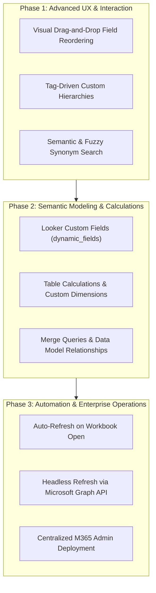

# Product & Engineering Roadmap

This document outlines the strategic and architectural roadmap for the Looker Microsoft Excel Taskpane Add-in. It encompasses capabilities discussed for future milestones, expanding upon the MVP foundation to achieve parity with enterprise BI plugins (such as SAP Analysis for Microsoft Office) while leveraging Looker's semantic modeling platform and Microsoft Excel's native analytics engine.

---

## Roadmap Overview & Phases



---

## 1. Visual Drag-and-Drop Field Reordering

### Context & Need
In Excel, column sequence directly reflects the order of fields in the Looker query definition. Currently, selected fields appear in the order in which users clicked them. Reordering columns requires clearing or deselecting and re-selecting fields in the exact intended sequence.

### Proposed Architecture
- **Interactive Chip Drawer**:
  - Upgrade the `selectedBar` in `FieldPicker.tsx` using HTML5 Drag and Drop API or a lightweight drag-and-drop utility (e.g., `@hello-pangea/dnd` or native pointer event listeners).
  - Add visual drag handles (`ReorderRegular` or `GripperDotsVerticalRegular`) to each selected field chip.
- **State Management**:
  - Maintain an explicit `selectedFields: string[]` ordered array in `App.tsx`.
  - On drag release (`onDragEnd`), update the array order:
    ```typescript
    const reorder = (list: string[], startIndex: number, endIndex: number): string[] => {
      const result = Array.from(list);
      const [removed] = result.splice(startIndex, 1);
      result.splice(endIndex, 0, removed);
      return result;
    };
    ```
- **Worksheet Synchronization**:
  - When reordered, the column definition array (`columns: ColumnDefinition[]`) sent to `writeLookerDataToWorksheet()` will reflect the new ordering immediately on next run or refresh.
  - When hydrating an existing query from `sheet.customProperties`, preserve the stored field sequence exactly.

---

## 2. Looker Custom Fields (`dynamic_fields`)

### Context & Need
Users frequently need ad-hoc variations of existing metrics (e.g., calculating Gross Margin `%` as `(Revenue - Cost) / Revenue`, or creating a custom dimension binning order values into Small, Medium, Large) without modifying the production LookML model.

### Technical Architecture
- **Looker API Contract**:
  - Looker API `/api/4.0/queries` accepts a `dynamic_fields` parameter containing serialized JSON.
  - Structure:
    ```json
    [
      {
        "measure": "custom_gross_margin",
        "based_on": "order_items.sale_price",
        "type": "sum",
        "label": "Custom Gross Margin",
        "expression": "${order_items.sale_price} - ${order_items.cost}",
        "value_format": "$#,##0.00"
      },
      {
        "table_calculation": "percent_of_total_sales",
        "label": "Percent of Total Sales",
        "expression": "${order_items.total_sale_price} / sum(${order_items.total_sale_price})",
        "value_format": "0.0%"
      }
    ]
    ```
- **UI Integration**:
  - Introduce a "Custom Calculations" modal accessible from the Field Picker.
  - Include syntax verification and type validation before committing to the query payload.
  - Stream calculated fields alongside standard dimensions and measures with proper Excel formatting masks.

---

## 3. Scheduled & Background Refreshes

### Context & Need
Enterprise financial models and executive reporting packets require data to refresh automatically on a schedule (e.g., daily at 6:00 AM) or upon opening the workbook, without requiring manual taskpane interaction.

### Architecture Options

#### Option A: Headless Server-Side Refresh via Microsoft Graph API (Primary Enterprise Pattern)
Office.js runs inside an active client process (Excel Desktop or Web). It cannot execute when the user's computer is off or Excel is closed.
- **Workflow**:
  1. Workbooks reside in Microsoft OneDrive for Business or SharePoint Online.
  2. A serverless service (Cloud Run, Cloud Function, or Azure Function) is triggered on a cron schedule via Google Cloud Scheduler.
  3. The service reads the stored Looker configuration from worksheet custom properties using the **Microsoft Graph Excel REST API**:
     ```http
     GET https://graph.microsoft.com/v1.0/drives/{drive-id}/items/{item-id}/workbook/worksheets/{sheet-id}/customProperties('looker_query_config')
     ```
  4. The service authenticates with Looker via dedicated service account credentials (API3 keys), executes the query asynchronously, and updates the worksheet ranges directly via Graph API batch range update calls:
     ```http
     PATCH https://graph.microsoft.com/v1.0/drives/{drive-id}/items/{item-id}/workbook/worksheets/{sheet-id}/range(address='A1:Z1000')
     ```
  5. The workbook is updated in place, ready for the user upon their next login.

#### Option B: Client-Side Auto-Refresh on Workbook Open
- Add an "Auto-refresh on open" setting in `sheetMetadata.ts`.
- Register an event handler on taskpane initialization or workbook activation (`Office.EventType.DocumentSelectionChanged` or `Excel.Workbook.onActivated`).
- If enabled, the add-in performs a silent token check and triggers `executeActiveSheetRefresh()` automatically when the workbook opens.

---

## 4. Looker Merge Queries vs. Excel Data Model

### Context & Need
Cross-domain analytics often require data from disparate explores (e.g., combining Marketing Spend from `marketing_explore` with Revenue from `ecomm_explore` joined on `campaign_id` and `date`).

### Evaluation
- **Looker Merge Queries (`/api/4.0/merge_queries`)**:
  - Looker executes separate queries and joins the result sets in the Looker server tier before sending results to the client.
  - *Drawback*: Designing an intuitive join mapping UI (primary query, secondary queries, dimension mapping, join types) inside a 350px taskpane involves significant complexity and edge-case management.
- **Excel Native Approach (Recommended)**:
  - Import each Explore into dedicated worksheets (e.g., Tab 1: `Marketing Spend`, Tab 2: `Ecommerce Revenue`).
  - Instruct users to create relationships using Excel's built-in **Power Pivot / Data Model** (`Data > Relationships`).
  - Allows analysts to build Excel PivotTables and dynamic formulas spanning multiple Looker explores while retaining native Excel performance.

---

## 5. Multi-Tab Architecture & Workbook Catalog

### Current Implementation & Next Steps
- **Current State**: Each worksheet tab maintains independent state via `worksheet.customProperties` (`looker_query_config`). Switching tabs updates the taskpane to reflect that specific sheet's configuration.
- **Roadmap Additions**:
  - **Workbook Query Manager**: A centralized catalog screen listing all Looker-connected sheets in the active workbook, displaying last refreshed timestamps, row counts, and error states.
  - **Global Dependency Refreshes**: Allow users to specify refresh order for sheets that feed downstream calculations.
  - **Batch Token Re-use**: Execute multi-sheet refreshes in parallel using a single authenticated session.

---

## 6. LookML `tags` as Custom Hierarchies

### Context & Need
LookML explores group fields by view label and dimension groups. In complex enterprise models (e.g., General Ledger, Chart of Accounts, Product Taxonomies), users require domain-specific hierarchical drill-downs that span multiple views.

### Proposed Architecture
- **LookML Tag Convention**:
  - LookML fields define tags following a structured hierarchy pattern:
    ```lookml
    dimension: account_category {
      tags: ["hierarchy:financial_statement:level_1"]
    }
    dimension: account_sub_category {
      tags: ["hierarchy:financial_statement:level_2"]
    }
    ```
- **Taskpane Hierarchy View**:
  - Add a view mode toggle in `FieldPicker.tsx`: **View Grouping** vs. **Business Hierarchies**.
  - When **Business Hierarchies** is active, group fields into nested multi-level tree nodes parsed from the tag definitions.
  - Enables intuitive drill-down selection for financial and operational analysts.

---

## 7. Advanced Metadata & Natural Language Search

### Beyond MVP Synonyms
- **Fuzzy Search**: Implement Levenshtein-based fuzzy matching in `matchesFieldSearch` to accommodate typographical errors (e.g., searching `"reveue"` still matches `"revenue"`).
- **Natural Language Query Scaffolding**:
  - Integrate Looker's conversational analytics or Gemini API to parse natural language requests (e.g., "Monthly sales by category for 2025") into auto-selected dimensions, measures, filters, and pivots in the taskpane UI.

---

## 8. Enterprise Deployment & Governance

### Production Distribution
- **Microsoft 365 Centralized Deployment**:
  - Administrators upload `manifest.xml` directly to the Microsoft 365 Admin Center (`Settings > Integrated apps > Upload custom apps`).
  - Targets deployment to specific security groups, departments, or the entire organization.
  - Automatically activates the add-in in Excel Desktop (Windows/macOS) and Excel for the Web without manual sideloading.
- **Single Sign-On (SSO) & IdP Federation**:
  - Leverage Looker SAML 2.0 / OpenID Connect (OIDC) integration with corporate identity providers (Google Workspace, Okta, Microsoft Entra ID).
  - The OAuth PKCE flow automatically routes through the corporate IdP, enforcing Multi-Factor Authentication (MFA) and conditional access policies.
